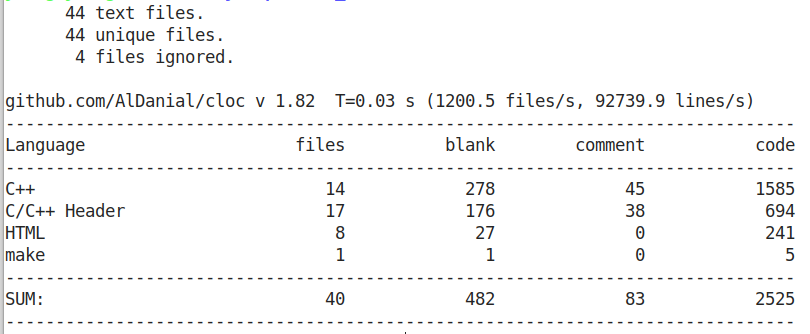

# **
MyHttpServer
**
* * *

## **Update**
**v1.0 -> v2.0** 
1. 对源代码进行修改，增加使用lamada表达式，智能指针，优化代码的可读性 
2. 增加redis中间层，以及增加redis连接池，对redis，mysql方法规划调整，改为使用工厂方法模式 
3. 修正了条件变量导致的虚假唤醒，是代码运行更为安全 
4. 对每个类都增加了一个单独的销毁方法，防止内存泄漏 

## **Background**
This is my initial contact with c++, refer to the relevant content on github to write a small rookie level http project

## **Install**
- OS:Ubuntu 18.04
- Comlier: gcc version 9.3.0 (Ubuntu 9.3.0-17ubuntu1~20.04) -std=c++11
- Thread model: posix

Please confiure your Linux has installed mysql and redis

`~$   make`

## **Usage**

`~$  ./server `

This project has its own default parameters, you can also custmoize parameters by youeself, but you should follow following rules.

	           opt                   explain               instance    default\n"
         "-L|--lineSize       max line of a log file         -L3000     20000\n"
         "-B|--blockSize      Async log's block size         -B3000     0\n"
         "-C|--connectSize    max number of connectpool      -C30       20\n"
         "-h|--host_mysql     mysql'host                     -hyoung    localhost\n"
         "-u|--account_mysql  load mysql's account           -uhil      root\n"
         "-p|--password_mysql load mysql's password          -p12333    123456\n"
         "-d|--datebase_mysql mysql's datebase               -dhjkl     web\n"
         "-P|--port_mysql     connect tp mysql's port        -P1234     3306\n"
         "-R|--redisSize      redis max client               -R20       20\n"
         "-I|--redisIp        redis server ip               -I127.0.0.1 127.0.0.1\n"
         "-r|--redisPort      redis port                     -r6379     6379\n"
         "-H|--threadSize     max number of thread           -H24       4\n"
         "-T|--taskSize       max task block size            -T20       3000\n"
         "-?|--help           help                           -?\n"

like this `~$ ./server -L5000 -C100 -unull -p11111 -dweb -H6`

## **Technical Points**
1. 使用Epoll的IO多路复用，结合非阻塞IO，构造使用**半同步/半反应堆的并发模式**处理大量的http连接请求
2. 简单实现一个支持**同步/异步输出**的日志模块，输出记录相关的http连接处理以及server运行状态
3. 使用c++11的thread库实现一个线程池以避免线程创建与销毁的造成的额外开销
4. 使用mysql以及redis作为数据库，redis作为存储用户密码的中间容器，mysql则为最终存储容器
5. 利用**工厂方法模式**规划两种数据库的访问方式，并且建立**mysql，redis的数据库连接池**，避免频繁的创建与销毁
6. 数据库连接池以及线程池的实现均采用**单例模式**，防止创建多个实例化对象导致错误
7. 建立一个定时器，内部实现为链表数组，每个数组的链表均为升序链表的一个时间轮，能够保证定时删除的时间复杂度为O(1)
8. 构造一个http请求分析主从状态机，使请求解析管线化

## **Process**

## **Test**
Using WebBench to test my server, cancel the module of LOG and stop the io between harddisk and memory. Just use webbench to get a simple "hello world!" web page.
> 
> 

Also I test the whole module in my server, use wenbench to get my designed web index.
> 
> 
## **Code**
> 
## **Reference**
1.游双.Linux高性能服务器编程[M].机械工业出版社:,2013-05

