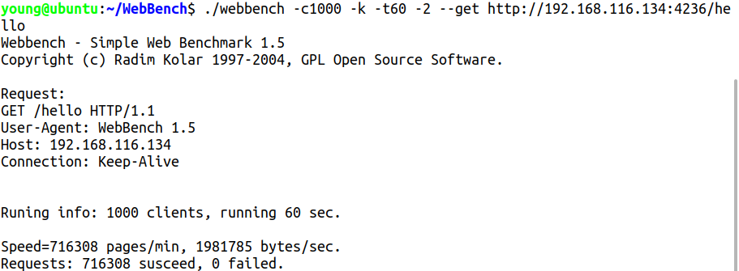

# **
MyHttpServer
**
* * *
## **Background**
This is my initial contact with c++, refer to the relevant content on github to write a small rookie level http project

## **Install**
- OS:Ubuntu 18.04
- Comlier: gcc version 9.3.0 (Ubuntu 9.3.0-17ubuntu1~20.04) 
- Thread model: posix

Please confiure your Linux has installed mysql

`~$   make`

## **Usage**

`~$  ./server `

This project has its own default parameters, you can also custmoize parameters by youeself, but you should follow following rules.

	      opt                 explain                  instance   default
	-L|--lineSize       max line of a log file         -L3000     500000
	-B|--blockSize      Async log's block size         -B3000     0
	-C|--connectSize    max number of connectpool      -C30       5
	-h|--host_mysql     mysql'host                     -hyoung    localhost
	-u|--account_mysql  load mysql's account           -uhil      root
	-p|--password_mysql load mysql's password          -p12333    123456
	-d|--datebase_mysql mysql's datebase               -dhjkl     book
	-P|--port_mysql     connect tp mysql's port        -P1234     3306
	-H|--threadSize     max number of thread           -H24       4
	-?|--help           help                           -?

like this `~$ ./server -L5000 -C100 -unull -p11111 -dweb -H6`

## **Technical Points**
1.  使用Epoll的IO多路复用，结合非阻塞IO，构造使用**半同步/半反应堆的并发模式**处理大量的http连接请求
2. 简单实现一个能够**同步/异步输出**的日志模块，输出记录相关的http连接处理以及server运行状态
3. 使用c++11的thread库实现一个线程池以避免线程创建与销毁的造成的额外开销
4. 利用mysql_c_api 实现一个连接池，主要适用于http的账户注册以及登录服务，实现功能较为简单
5. 实现一个利用升序的时间轮的定时器，结合Linux的信号处理，定时对过期连接清除
6. 构造一个http请求分析状态机，使请求解析管线化

## **Process**

## **Test**
Using WebBench to test my server, cancel the module of LOG and stop the io between harddisk and memory. Just use webbench to get a simple "hello world!" web page.
> 
> 

Also I test the whole module in my server, use wenbench to get my designed web index.
> 
> 
## **Code**
> 
## **Reference**
1.游双.Linux高性能服务器编程[M].机械工业出版社:,2013-05

